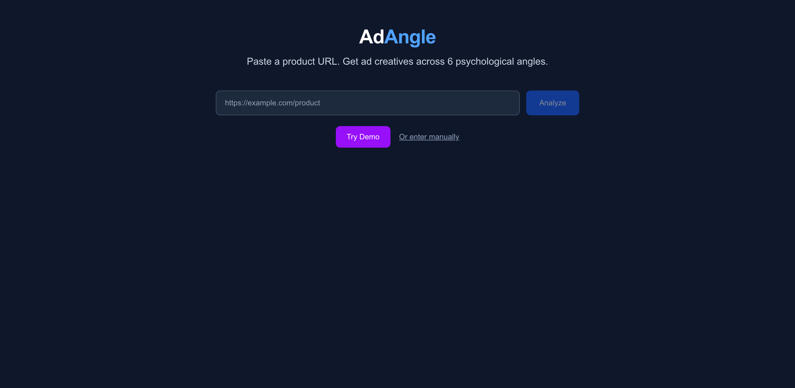
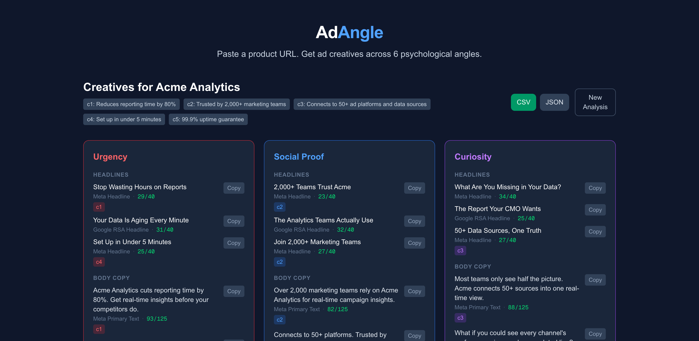
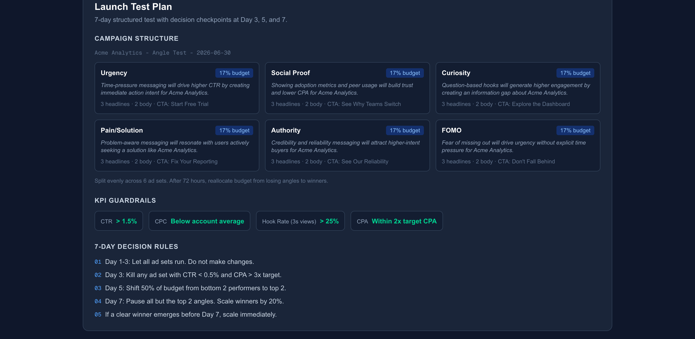
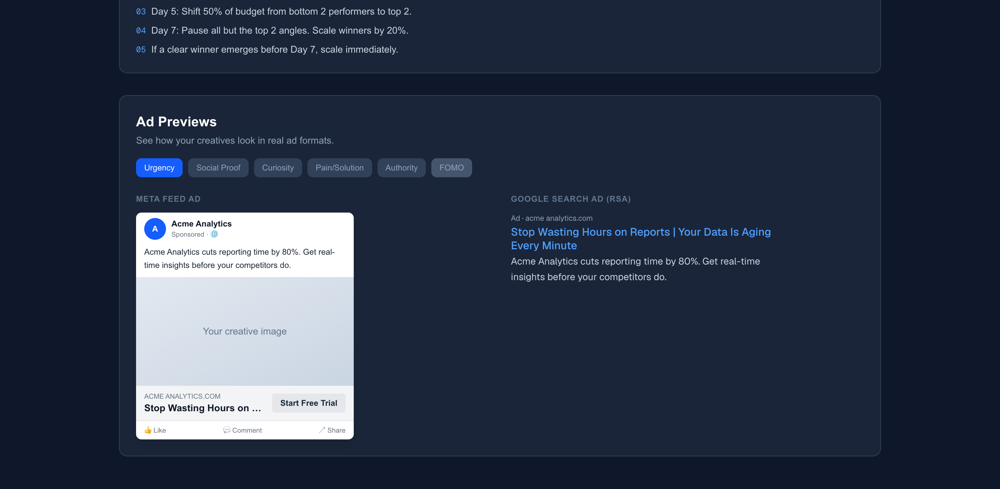

# AdAngle — AI Ad Creative Generator

**Paste a product URL. Get 30 platform-ready ad creatives, a launch test plan, and ad previews — in under 60 seconds.**

[Live Demo](https://adangle-seven.vercel.app) | [Try it now (no signup)](https://adangle-seven.vercel.app)



---

## What does it do?

AdAngle is an end-to-end creative pipeline for media buyers. Give it any product URL and it:

1. **Scrapes and extracts** product name, features, claims, pricing, and audience
2. **Generates 30 ad creatives** across 6 proven psychological angles
3. **Shows ad previews** — see exactly how copy looks in Meta feed ads and Google RSA format
4. **Builds a launch test plan** — campaign structure, hypotheses, budget split, KPI guardrails, and 7-day decision rules
5. **Exports everything** as CSV (for bulk upload) or JSON (for programmatic use)

### The 6 Angles

| Angle | Strategy | Why it works |
|-------|----------|-------------|
| **Urgency** | Time pressure, scarcity | Drives immediate action |
| **Social Proof** | Adoption metrics, peer usage | Builds trust, lowers CPA |
| **Curiosity** | Questions, information gaps | Generates clicks through intrigue |
| **Pain/Solution** | Problem identification, resolution | Resonates with solution-seekers |
| **Authority** | Credibility, reliability | Attracts high-intent buyers |
| **FOMO** | Exclusivity, fear of missing out | Creates urgency without time limits |

Each angle produces **3 headlines** (max 40 chars), **2 body copy variants** (max 125 chars), and **1 CTA** (max 25 chars) — all within platform character limits.



### Grounded in facts, not hallucinations

Every creative references specific claims extracted from the product page. The AI is explicitly instructed never to invent numbers, ratings, endorsements, or guarantees. Each variant shows which source claims it references.

### Platform-ready output

Every creative is labeled with its ad platform slot:
- **Meta Headline** / **Google RSA Headline** — for headline fields
- **Meta Primary Text** — for body copy

Character compliance badges (green/red) show at a glance which creatives are within platform limits and which need editing.

---

## Why this tool?

Creative fatigue is the most expensive problem in performance marketing that nobody has good tooling for.

**The problem:** Ads stop performing. Media buyers need constant new copy variations across different angles. Generating these manually is slow, repetitive, and pulls attention from strategy and optimization.

**What exists today:** Generic AI copywriters that produce bland, ungrounded copy with no structure. No angle diversity, no platform formatting, no testing framework.

**What AdAngle does differently:**

1. **Extracts real claims** from the product page — no manual data entry, no hallucinated stats
2. **Structures output by angle** — 6 proven persuasion frameworks, not random variations
3. **Formats for platforms** — character limits, slot labels, and compliance badges built in
4. **Generates a test plan** — campaign structure, hypotheses, budget allocation, KPIs, and decision rules
5. **Shows previews** — see how creatives look in actual Meta and Google ad formats
6. **Exports for bulk upload** — CSV with columns matching ad platform import formats

A media buyer goes from product URL to launch-ready creative test in under 60 seconds.

---

## Launch Test Plan

AdAngle doesn't just generate copy — it generates a complete testing workflow:

- **Campaign structure** — one ad set per angle, named and organized
- **Per-angle hypotheses** — why each angle should work for this product
- **Budget allocation** — even split with reallocation rules
- **KPI guardrails** — CTR, CPC, Hook Rate, CPA targets
- **7-day decision rules** — when to kill, reallocate, and scale



---

## Ad Previews

See how your creatives look in real ad formats before launching:

- **Meta Feed Ad** — full mockup with profile, body, image placeholder, headline, CTA, engagement bar
- **Google Search Ad (RSA)** — headline pair with pipe separator, description, domain
- **Angle switcher** — toggle between all 6 angles to compare



---

## What would you build next?

If this were my full-time job, I'd build in this order:

1. **Performance feedback loop** — import campaign results (CTR, CPA by ad set), learn which angles win per vertical, and weight future generations toward winning patterns
2. **Ad platform API integration** — publish creatives directly to Meta Ads Manager and Google Ads without copy-pasting
3. **Image creative generation** — pair copy with AI-generated visuals matched to each angle
4. **Competitor analysis** — paste a competitor's ad, reverse-engineer their angle, generate counter-positioning
5. **Team collaboration** — save creative sets, share with team, track iterations over time

The core insight: **media buying teams don't need another AI copywriter. They need a creative testing system.** AdAngle is the foundation for that system.

---

## Tech Stack

| Layer | Technology |
|-------|-----------|
| **Framework** | Next.js 16 (App Router) |
| **Language** | TypeScript (strict) |
| **AI** | Claude API (Anthropic) — extraction + generation |
| **Scraping** | Cheerio + SSRF protection (manual redirect validation, private IP blocking) |
| **Validation** | Zod — API I/O + LLM output enforcement with relaxed fallback |
| **Styling** | Tailwind CSS |
| **Testing** | Vitest — 41 tests (schemas, SSRF, LLM mocks, API routes, exports) |
| **Deployment** | Vercel |

## Run Locally

```bash
git clone https://github.com/saneGuy/adangle.git
cd adangle
npm install
echo "ANTHROPIC_API_KEY=your-key-here" > .env.local
npm run dev
```

Open [http://localhost:3000](http://localhost:3000). Click "Try Demo" for an instant example without an API key.

## Run Tests

```bash
npm test        # 41 tests across 6 test files
```

## Architecture

```
app/
  page.tsx                — Single-page wizard (input → brief → results)
  api/scrape/route.ts     — POST: URL → product brief (Cheerio + Claude)
  api/generate/route.ts   — POST: brief → creatives (Claude + Zod validation)
  components/
    UrlInput.tsx           — URL input with loading state
    ProductBriefForm.tsx   — Editable extraction review + manual fallback
    AngleCard.tsx          — Creative card with compliance badges + grounding
    CopyButton.tsx         — Copy-to-clipboard with feedback
    ExportButtons.tsx      — CSV + JSON download
    TestPlanCard.tsx       — Campaign structure, KPIs, decision rules
    AdPreview.tsx          — Meta feed + Google RSA mockups
lib/
  schemas.ts              — Zod schemas for all data types
  scraper.ts              — URL fetching with SSRF protection
  llm.ts                  — Claude API client with retry on validation failure
  prompts.ts              — System prompts for extraction + generation
  export.ts               — CSV + JSON export helpers
  test-plan.ts            — Test plan generation from creatives
  demo-data.ts            — Preloaded demo data
```
